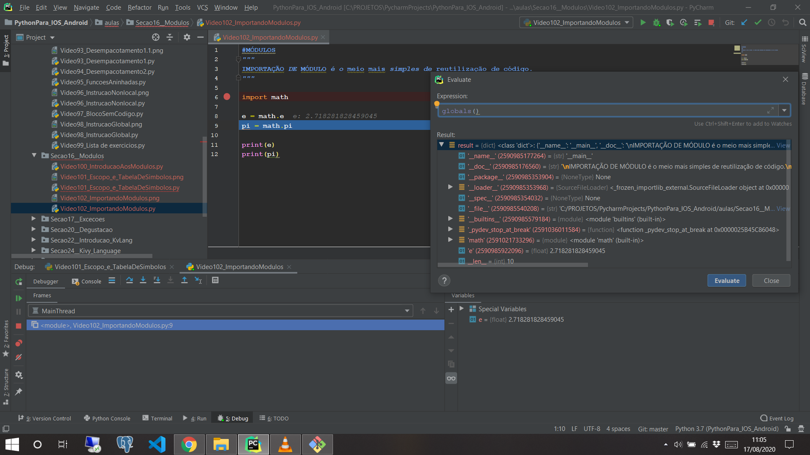
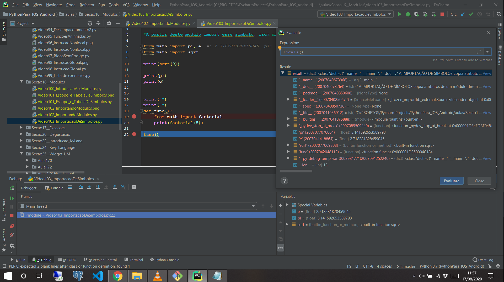
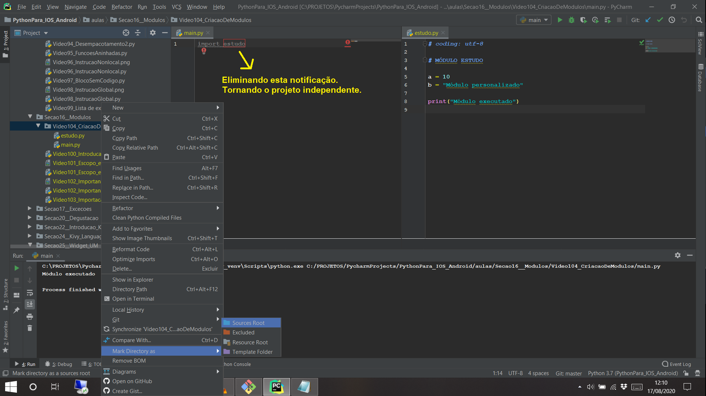
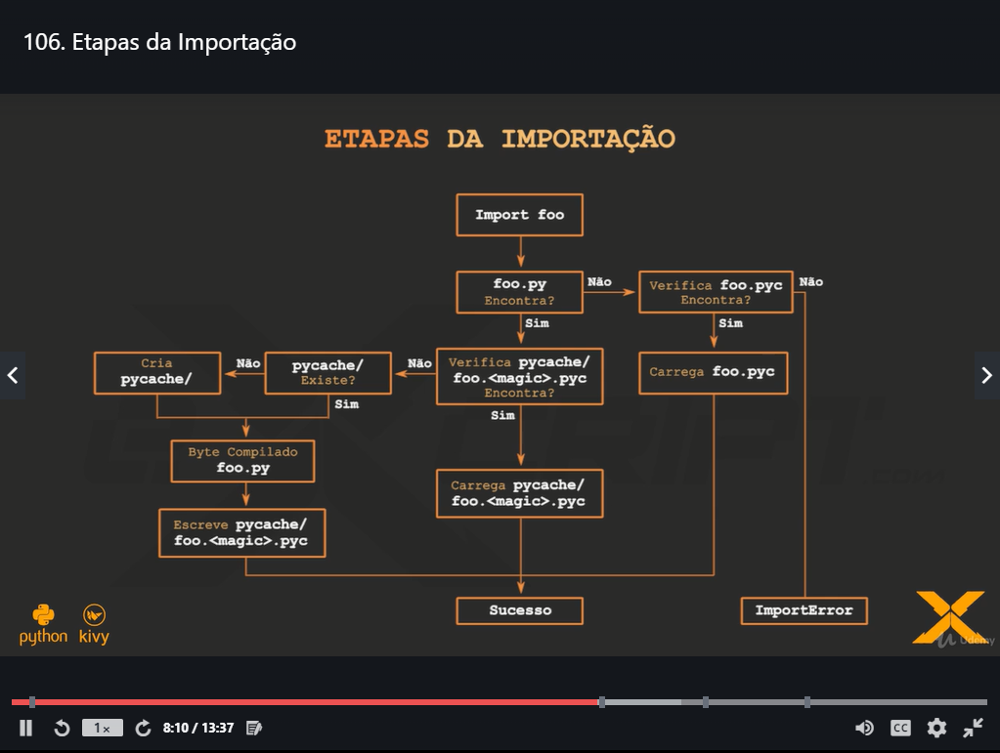
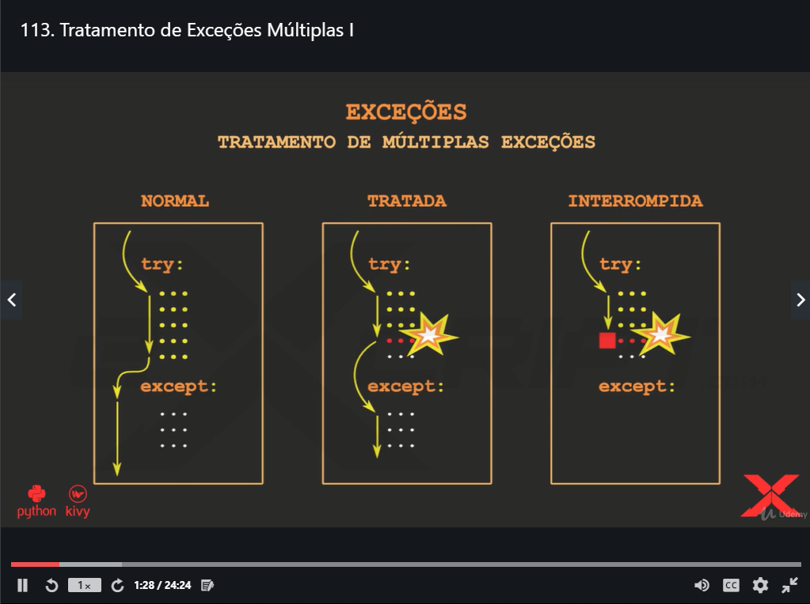
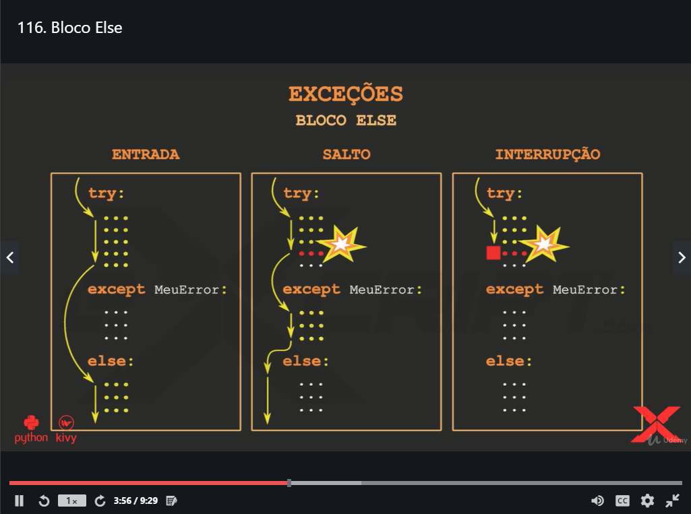
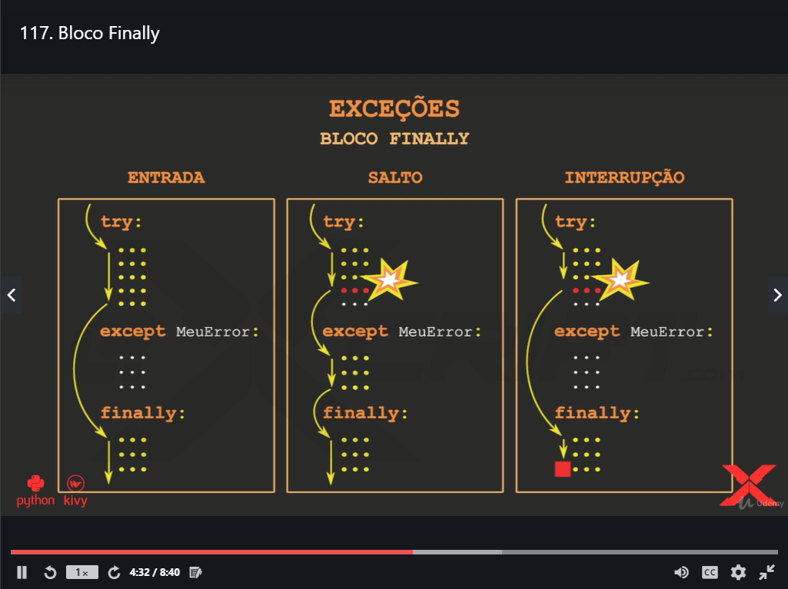
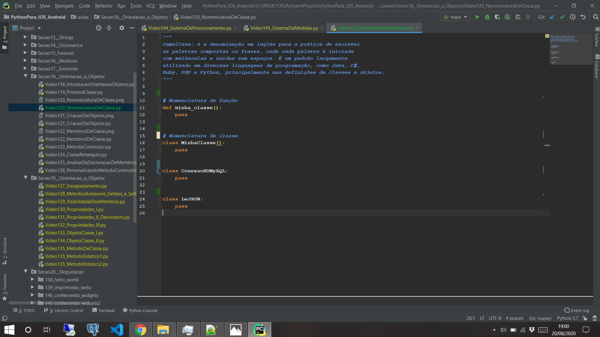
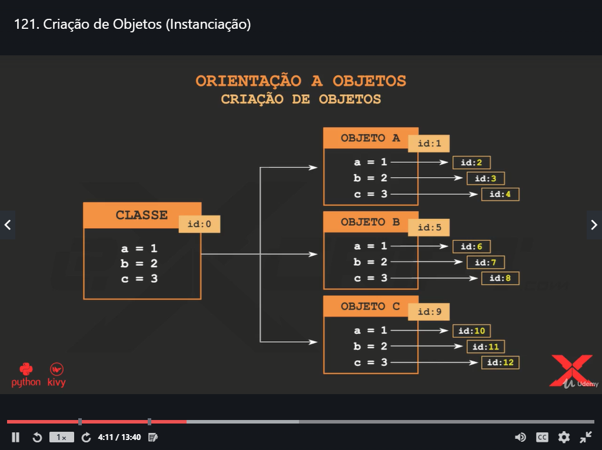
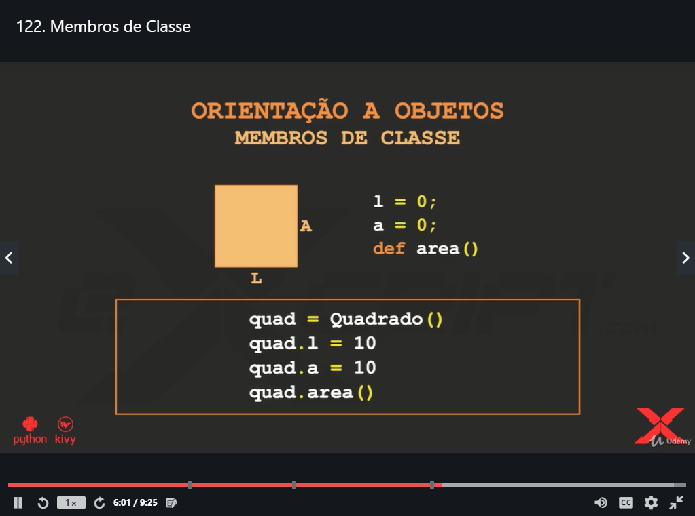

# :snake: Python e KIVY para IOS e Android

### IMAGEM DA VIDEO AULA 102 - IMPORTANDO MÓDULOS

### IMAGEM DA VIDEO AULA 103 - IMPORTAÇÃO DE SÍMBOLOS

### IMAGEM DA VIDEO AULA 104 - CRIAÇÃO DE MÓDULOS

### IMAGEM DA VIDEO AULA 106 - ETAPAS DA IMPORTAÇÃO

### IMAGEM DA VIDEO AULA 113 - TRATAMENTO DE EXCEÇÕES MÚLTIPLAS

### IMAGEM DA VIDEO AULA 116 - TRATAMENTO DE EXCEÇÕES BLOCO ELSE

### IMAGEM DA VIDEO AULA 117 - TRATAMENTO DE EXCEÇÕES BLOCO FINALLY

### IMAGEM DA VIDEO AULA 120 - NOMENCLATURA DE CLASSE

### IMAGEM DA VIDEO AULA 121 - CRIAÇÃO DE OBJETOS (INSTANCIAÇÃO)

### IMAGEM DA VIDEO AULA 122 - MEMBROS DE CLASSE

